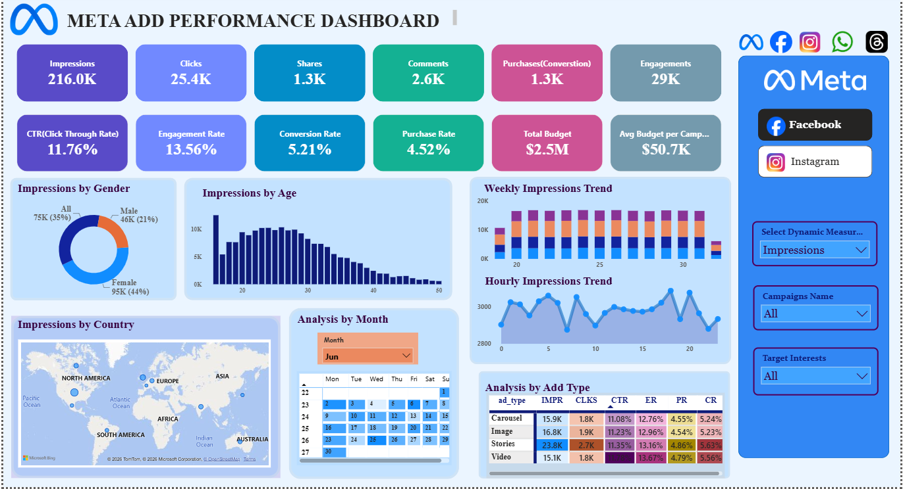
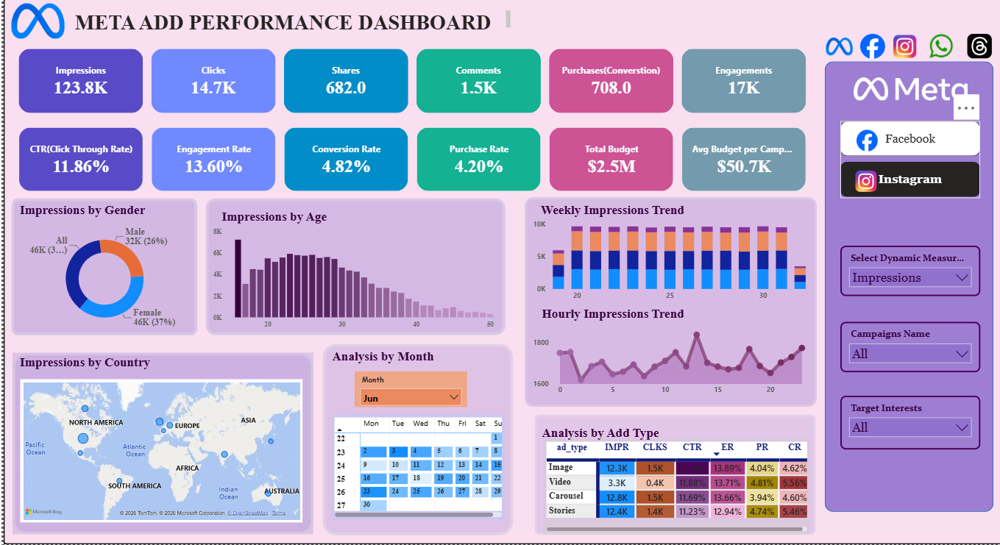

# 📊 Meta Ads Performance Dashboard | Power BI

> **An interactive Power BI dashboard for analyzing Meta (Facebook & Instagram) advertising campaigns using Power Query, DAX, and interactive visualizations.**

---

# 📌 Project Overview

Marketing teams generate massive amounts of advertising data every day, but raw reports alone make it difficult to understand campaign performance.

This project transforms raw Meta Ads campaign data into an interactive Power BI dashboard that helps stakeholders monitor campaign performance, evaluate audience engagement, optimize advertising spend, and identify the highest-performing ad formats.

The dashboard combines data modeling, Power Query transformations, DAX calculations, and interactive visualizations to deliver actionable marketing insights in a clean, executive-friendly format.

---

# 🎯 Business Objectives

This dashboard helps answer questions such as:

- Which campaigns generated the highest impressions?
- Which audience segments engage the most?
- Which ad format performs best?
- How efficient is the advertising budget?
- What are the CTR, Engagement Rate, Purchase Rate, and Conversion Rate?
- Which countries generate the highest impressions?
- How does campaign performance change over time?

---
# 🖼 Dashboard Preview

  
  

> **Theme 1:** Blue Professional Theme  
> **Theme 2:** Purple Professional Theme
---